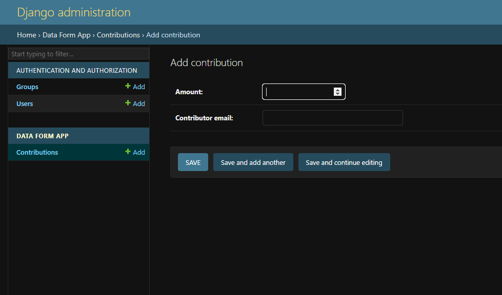

# DataForm
**The Project has three pages**

**To display the form use: [http://127.0.0.1:8000/](http://127.0.0.1:8000/)**

**To display the output list use: [http://127.0.0.1:8000/contribution-list/](http://127.0.0.1:8000/contribution-list/)**

1. **Open the Codespace Terminal:**

   In your Codespace, open the integrated terminal from the "Terminal" menu.

2. **Create a Virtual Environment:(Can be skipped to step 3)**

   ```bash
   python -m venv venv
   ```

3. **Activate the Virtual Environment:**

   For Windows:
   ```bash
   .\venv\Scripts\activate
   ```
   For macOS and Linux:
   ```bash
   source venv/bin/activate
   ```

4. **Install Project Dependencies:**

   Navigate to your Django project directory, then:
   ```bash
   pip install -r requirements.txt
   ```

5. **Database Setup:**

   If your Django project uses a database:
   ```bash
   python manage.py makemigrations
   python manage.py migrate
   ```

6. **Run the Django Development Server:**

   ```bash
   python manage.py runserver
   ```
7. **Output**

    
